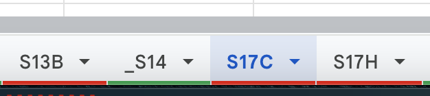
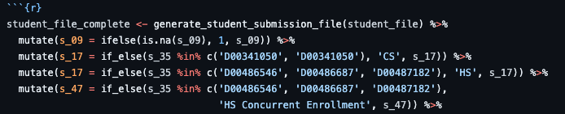

```{r setup, include=FALSE}
knitr::opts_chunk$set(
  echo = FALSE,
  warning = FALSE,
  message = FALSE
  )
```

```{r load libraries, include=FALSE}
library(gt)
library(here)
library(shiny)
library(purrr)
#source(here::here('R', 'munge.R'))
#source(here::here('R', 'make_slides.R'))
library(emo)
```

class: opener
# Welcome 🎉

---
class: inverse, left
# Where We Are

Please be sure to look both ways before crossing!


---
class: left
# Key Outcomes of Automation Using R

AKA: "Everything is Awesome!"

* Time: What previously could take up to 2 hours to run the SQL behind a report for IPEDS or USHE can now be run in minutes.

* Collaboration: Using version control in GitHub, project management is easily reviewed and merged to incorporate all our individual work.

* Successful Data Auditing: Through the use of daily automated data audit reports, data stewards at Utah Tech are receiving daily reports to address errors. This process has created a cleaner data set that we use to create our reporting submission files.

* Error Resolution: Error or "Fix" files that come back to us after an initial report submission are jokingly referred to as "bleeding" with red/fatal errors. By writing simple mutate statements within the body of our file submission markdown file we can quickly resolve fatal errors and resubmit for additional review.

---
class: left
# Error Resolution In Action

Example of a Fatal Error in our Fall 22 3rd Week submission, round 1. Here we are looking at fixing element S17, which is a conflict between a previous and current registration status:



Using this small chunk of code to write a mutate statement in our Markdown submission file, we can quickly resolve fatal errors that are impacting four id numbers using just a few lines of code:



Outcome: Fall 2022 End of Term first submission, error resolution and final submission was done in less than 3 rounds of fixes, taking approximately 4 hours in one week to clear.


---
class: left
# Thank You & Questions

The creation, validation, and testing of this process occurred during the summer of 2022 and was fully live and in production for Fall 2022. 

We would like to extend our thanks to the USHE System Office, especially Chance Groskreutz and Matt Baxter for their willingness to assist us in the testing process last summer.

---